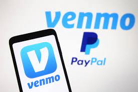

# Venmo  



# Description 
Class activity doing a case study on Venmo, which is a method of payment 

## **Contributers:** 
Tyler Gehbauer and
Brian Lui

# Venmo Case Study Report

**What is the background of your company? What do they do? Who are their competitors?**
````
- Venmo is a mobile payment service owned by PayPal. Venmo account holders can transfer funds to others via a mobile phone app; both the sender and receiver have to live in the U.S.
- Their Competitors are other mobile payment services like CashApp or Zelle
````

**How does this company use technology to their advantage? Why are they considered a FinTech company?**

```
- Instead of having to transfer money via bank wire or physical cash, we are now able to transfer money instantly without being present with the person. They are considered a FinTech company because they have changed the Payments/Billing domain in finance through the use of technology and mobile phone apps 
```

**Why is this company exemplary in the FinTech space? What are their strengths and weaknesses?**

```
- Venmo was the first consumer to consumer payment app that showed the ease of access with technology
- Venmo's strength is that is it quick, easy, and user-interface friendly.
- Venmo's weakness is that you have to individually request or pay a person instead of doing a group request.
```

**What is the prognosis for this company? Where do they expect to be in the future?**
```
- Venmo will start allowing payments/transfer of crypto
- They will be a credit card company and crypto company
```